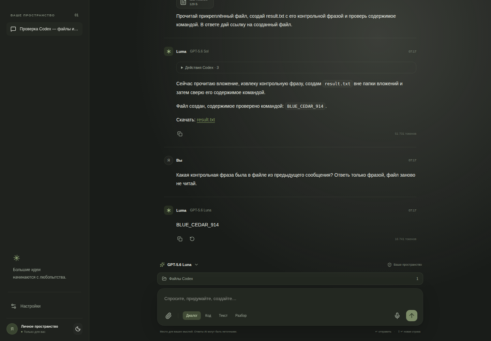
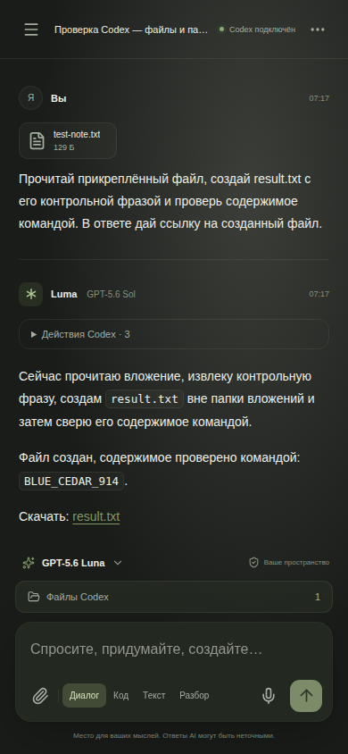
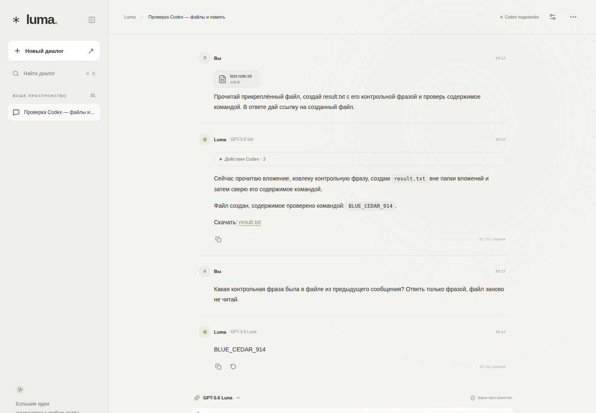
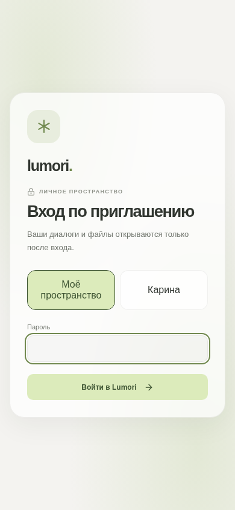

# Lumori

Private, self-hosted AI workspace powered by the Codex App Server and ChatGPT authentication.

Lumori gives a small trusted group a polished chat interface for coding, study, documents and everyday tasks. It runs on a VPS, keeps conversations separated by account, and does not require an OpenAI API key in the web application.

## Highlights

- Persistent Codex threads with model switching and per-user chat history.
- Text, image and document attachments: PDF, Office, spreadsheets, presentations, CSV, JSON and source code.
- Safe artifact links with downloads for files created in a conversation.
- Local CPU speech recognition with faster-whisper for Russian and English.
- Rendered Markdown, GFM tables, syntax-highlighted code and KaTeX mathematics.
- Light/dark themes, independent accent colors and a responsive iOS-style glass interface.
- Temporary chats, chat deletion, progress events and usage-limit indicators.
- Private login page, secure cookies, rate limits, ownership checks and a restricted Codex workspace.

## Screenshots

| Desktop | Mobile |
| --- | --- |
|  |  |
|  |  |

## Architecture

```text
Browser ─ HTTPS ─ reverse proxy ─ Lumori (Node.js + SQLite)
                                      │
                                      ├─ private WebSocket ─ Codex App Server
                                      ├─ per-chat workspaces and artifacts
                                      └─ local faster-whisper process
```

The browser never receives the Codex bridge token or ChatGPT credentials. Codex runs in a restricted workspace with no arbitrary visitor access. Uploaded files are treated as data and are not trusted as instructions.

## Local development

Requirements: Node.js 24 and an authenticated Codex CLI.

```bash
codex login
codex app-server --listen ws://127.0.0.1:8091
npm ci
cp .env.example .env
npm run dev
```

Open `http://localhost:5173`. Configure a local password and session secret in `.env`; never commit that file.

Useful checks:

```bash
npm run check
npm test
npm run build
```

## VPS deployment

The repository includes systemd, reverse-proxy and deployment examples under `docs/deployment/`. The deployment script is intended for an already secured VPS with Codex authentication configured. It builds the client and server, copies the production files and restarts the web service.

Before deployment, configure the environment outside Git with a strong application password, a session secret, the Codex bridge token and the data directory. Keep the reverse proxy restricted to HTTPS and do not expose the Codex App Server publicly.

## Project structure

- `src/` — chat UI, themes, responsive layout, composer, Markdown and math rendering.
- `server/` — authentication, SQLite storage, Codex bridge, artifacts, speech and limits.
- `shared/` — types shared by the client and server.
- `speech/` — optional local faster-whisper transcription.
- `tests/` — server, security, terminal, artifact and rendering checks.
- `docs/` — design notes, validation records, previews and deployment examples.

## Privacy

Lumori is designed for a private trusted group. Keep the repository private, do not commit `.env`, databases, uploads, ChatGPT credentials, SSH keys, model weights or generated workspaces. Rotate session and bridge secrets if they are ever exposed.

## License

Private project. All rights reserved unless the repository owner adds a separate license.
