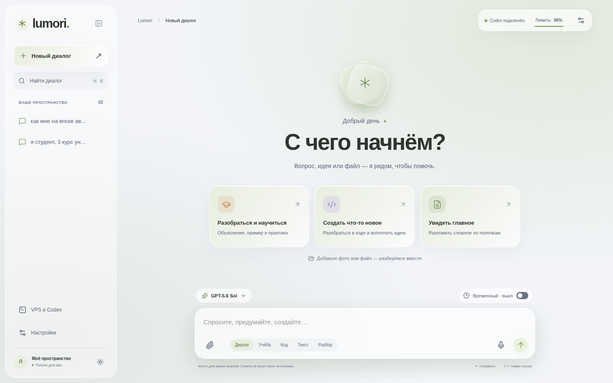
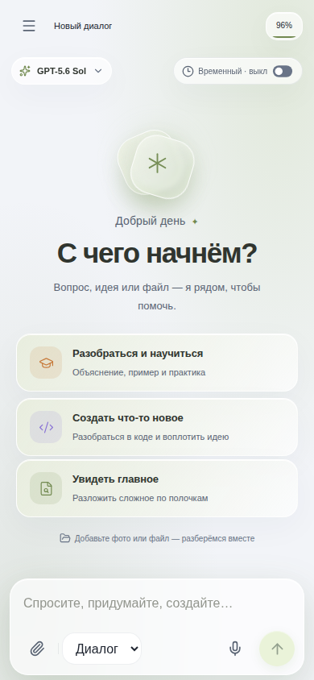
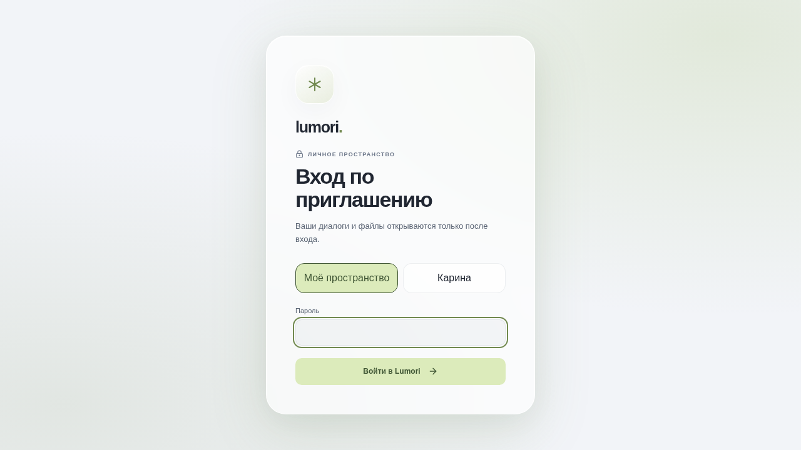
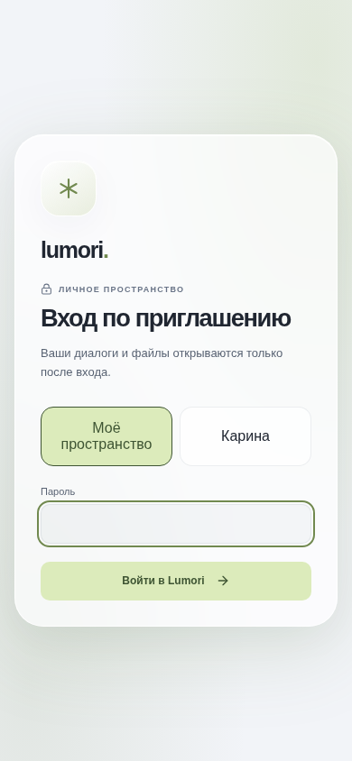

# Lumori

Приватное self-hosted AI-пространство для программирования, учёбы, работы с документами и повседневных задач. Lumori работает через установленный на VPS Codex App Server и авторизацию ChatGPT — веб-приложению не нужен OpenAI API-ключ.

## Возможности

- Постоянные диалоги Codex с переключением моделей и отдельной историей пользователей.
- Прикрепление фото и файлов: PDF, Excel, Word, PowerPoint, CSV, JSON и исходный код.
- Чтение вложений и скачивание файлов, созданных в чате.
- Локальное распознавание русской и английской речи через faster-whisper на CPU.
- Markdown, таблицы GFM, подсветка кода и читаемая отрисовка формул KaTeX.
- Светлая и тёмная темы, отдельные акцентные цвета и адаптивный стеклянный интерфейс для iOS.
- Временные чаты, удаление истории, индикаторы прогресса и лимитов.
- Авторизация, защищённые cookie, ограничение частоты запросов и проверка владельца каждого чата.

## Скриншоты актуальной версии

| Рабочий стол | Телефон |
| --- | --- |
|  |  |
|  |  |

## Архитектура

```text
Браузер ─ HTTPS ─ reverse proxy ─ Lumori (Node.js + SQLite)
                                      │
                                      ├─ приватный WebSocket ─ Codex App Server
                                      ├─ рабочие папки чатов и артефакты
                                      └─ локальный процесс faster-whisper
```

Браузер не получает токен WebSocket-моста, ChatGPT-учётные данные или произвольный доступ к JSON-RPC. Codex работает в ограниченной рабочей папке. Вложенные файлы передаются как данные и не считаются инструкциями.

## Локальный запуск

Нужны Node.js 24 и авторизованный Codex CLI.

```bash
codex login
codex app-server --listen ws://127.0.0.1:8091
npm ci
cp .env.example .env
npm run dev
```

Откройте `http://localhost:5173`. В `.env` задайте локальный пароль и секрет сессии. Файл `.env` нельзя добавлять в Git.

Проверки проекта:

```bash
npm run check
npm test
npm run build
```

## Деплой на VPS

Примеры конфигурации systemd, reverse proxy и обновления находятся в `docs/deployment/`. Скрипт деплоя рассчитан на уже защищённый VPS с настроенной авторизацией Codex: он собирает клиент и сервер, копирует production-файлы и перезапускает веб-службу.

Перед деплоем задайте вне Git сильный пароль приложения, секрет сессии, токен моста Codex и каталог данных. Reverse proxy должен работать только по HTTPS, а Codex App Server нельзя открывать в интернет.

## Структура проекта

- `src/` — интерфейс чата, темы, адаптивная вёрстка, composer, Markdown и математический рендеринг.
- `server/` — авторизация, SQLite, мост Codex, артефакты, речь и лимиты.
- `shared/` — типы, общие для клиента и сервера.
- `speech/` — необязательное локальное распознавание через faster-whisper.
- `tests/` — проверки сервера, безопасности, терминала, файлов и рендера.
- `docs/` — дизайн, результаты валидации, скриншоты и примеры деплоя.

## Приватность

Lumori рассчитан на небольшую доверенную группу. Репозиторий должен оставаться приватным. Не добавляйте в Git `.env`, базы данных, загрузки, ChatGPT-данные, SSH-ключи, веса моделей и рабочие папки. При утечке секретов замените пароль приложения, секрет сессии и токен моста.

## Лицензия

Приватный проект. Все права защищены, если владелец репозитория отдельно не добавит лицензию.
